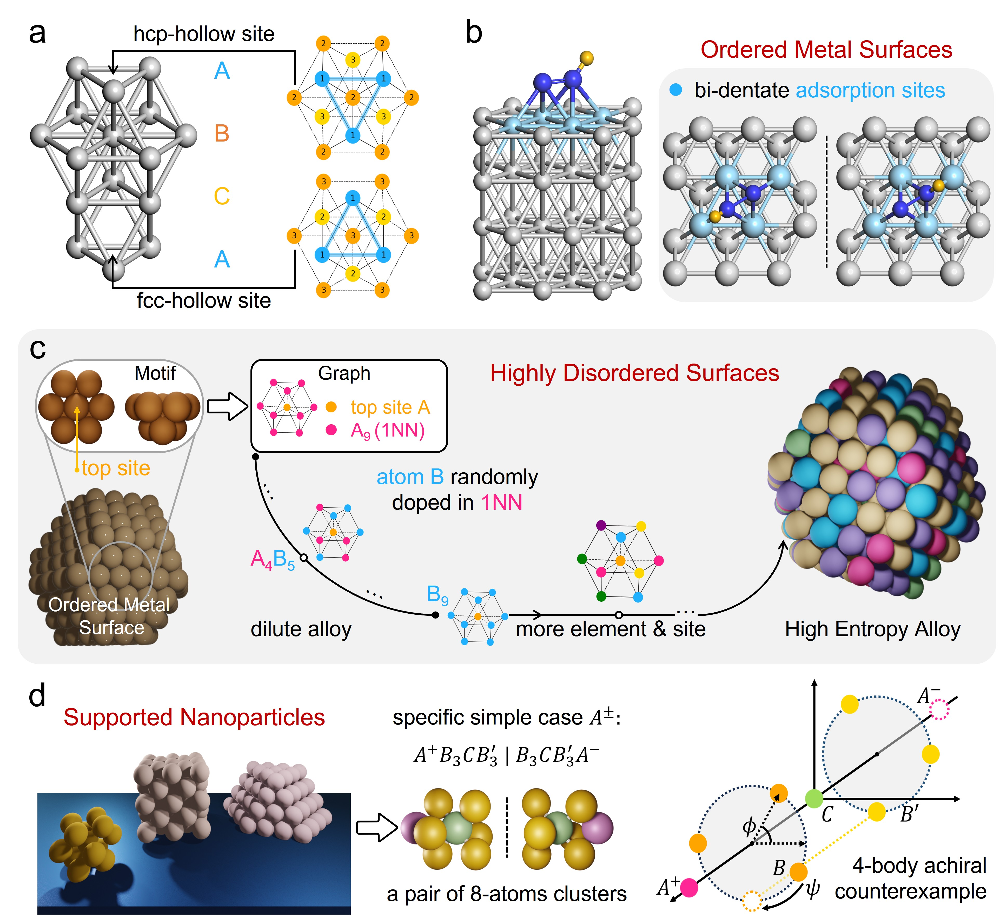

This folder contains the codes necessary to perform the equivariant graph neural network (**equivGNN**) model, as described in our paper: [Resolving chemical-motif similarity with enhanced atomic structure representations for accurately predicting descriptors at metallic interfaces](https://doi.org/10.1038/s41467-025-63860-x).

**Figure |Chemical motifs at different metallic interfaces with various degrees of complexity**


Accurately predicting catalytic descriptors with machine learning (ML) methods is significant to achieving accelerated catalyst design, where a unique representation of the atomic structure of each system is the key to developing a universal, efficient, and accurate ML model that is capable of tackling diverse degrees of complexity in heterogeneous catalysis scenarios. Herein, we integrate equivariant message-passing-enhanced atomic structure representation to resolve chemical-motif similarity in highly complex catalytic systems. Our developed equivariant graph neural network (equivGNN) model achieves mean absolute errors < 0.09 eV for different descriptors at metallic interfaces, including complex adsorbates with more diverse adsorption motifs on ordered catalyst surfaces, adsorption motifs on highly disordered surfaces of high-entropy alloys, and the complex structures of supported nanoparticles. The prediction accuracy and easy implementation attained by our model across various systems demonstrate its robustness and potentially broad applicability, laying a reasonable basis for achieving accelerated catalyst design.

# Example of usage:
Expected output in ./pre-trained/5fold/
```
python -W ignore train_complex_5fold.py 5fold/test simpleads 5e-3 1e-5 100 0
```

# Datasets:
### External Dataset Source [related link & references]:
Simple & Complex Dataset: https://github.com/Wenbintum/WWL-GPR [Nat. Comput. Sci. 2, 443-450 (2022)]

Organic Dataset: https://gitlab.com/iciq-tcc/nlopez-group/gnn_eads [Nat. Comput. Sci. 3, 433-442 (2023)]

HEA Dataset: https://ars.els-cdn.com/content/image/1-s2.0-S2590238524005289-mmc2.zip [Matter 7, 1-15 (2024)]

B8-cluster Dataset: https://github.com/curiosity54/completeness-three-center [APL Mach. Learn. 2, 016110 (2024)]

Coverage Dataset: https://gitlab.com/jgreeley-group/ace_gcn [Nat. Commun. 13, 5788 (2022)]

### In-house Dataset Source [related link & references]:
Cads & 3-fold-only Cads Dataset: ./data/data_Cads

### Data preprocessing: 
Covalent radii based graph construction process for simpleads dataset is shown in [prepare_dataset.py](./data/prepare_dataset.py)

# References & Citing
Please cite our paper if you find the code helpful or if you want to use the benchmark results. Thank you!
```
@article{woshicc1121,
	title = {Resolving chemical-motif similarity with enhanced atomic structure representations for accurately predicting descriptors at metallic interfaces},
	doi = {10.1038/s41467-025-63860-x},
	journaltitle = {Nature Communications},
	author = {Cai, Cheng and Wang, Tao},
	date = {2025-09},
}
```
